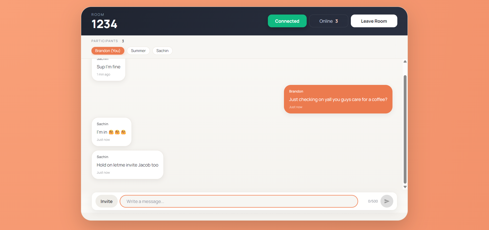
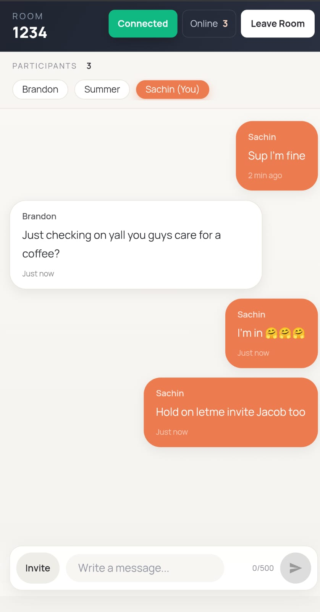
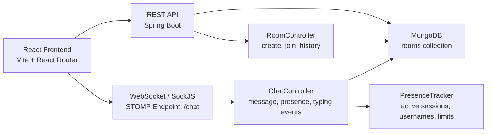

# Instant Talk

<div align="center">

### Real-Time Chat Platform Built With Java, Spring Boot, WebSocket/STOMP, MongoDB, React, and Dockerized For Deployment 

[](https://openjdk.org/)
[](https://spring.io/projects/spring-boot)
[](https://stomp.github.io/)
[](https://www.mongodb.com/)
[](https://react.dev/)
[](https://www.docker.com/)

Fast, room-based chat with real-time messaging, live presence, typing indicators, invite links, and ephemeral room cleanup when the last participant leaves.

</div>

---

<table align="center">
  <tr>
    <td align="center" width="50%">
      
    </td>
    <td align="center" width="50%">
      
    </td>
  </tr>
</table>

---

## Real-Time Lifecycle

<table>
  <tr>
    <td width="25%" valign="top">
      <strong>1. Room Entry</strong><br/><br/>
      Users create or join a room through REST validation before opening a live socket session.
    </td>
    <td width="25%" valign="top">
      <strong>2. Presence Registration</strong><br/><br/>
      The backend tracks active sessions, blocks duplicate usernames, and enforces the room capacity limit.
    </td>
    <td width="25%" valign="top">
      <strong>3. Live Event Stream</strong><br/><br/>
      Messages, typing signals, and presence updates are published over STOMP topics in real time.
    </td>
    <td width="25%" valign="top">
      <strong>4. Ephemeral Cleanup</strong><br/><br/>
      When the last participant disconnects, the room is automatically removed to keep storage clean.
    </td>
  </tr>
</table>

```text
Create / Join -> REST validation -> WebSocket connect -> Presence join
             -> Message + typing events -> Disconnect -> Auto room cleanup
```

<div align="center">

| System Focus | Implementation |
| --- | --- |
| Entry control | Room existence checks, username validation, participant limit enforcement |
| Event delivery | STOMP destinations for messages, typing, presence, and system events |
| Session safety | Server verifies active membership before accepting a message |
| Data lifecycle | MongoDB persistence during activity, deletion when room becomes empty |

</div>

---

## Experience Snapshot

| Area | What It Delivers |
| --- | --- |
| Messaging | Low-latency room-based message delivery |
| Presence | Live participant list and online count |
| Collaboration Signals | Typing indicators and invite sharing |
| Validation | Username, room ID, and message constraints enforced server-side |
| Persistence | MongoDB-backed room and message storage |
| Cleanup | Rooms removed automatically when inactive |
| Deployment Readiness | Docker backend, env-based config, SPA hosting support |

---

## Product Preview

<div align="center">
  
</div>

### Core User Flow

1. User creates or joins a room with a username.
2. Frontend validates the room through REST endpoints.
3. Client connects to `/chat` using SockJS and STOMP.
4. Presence is registered on join and broadcast to the room.
5. Messages, typing events, and presence updates stream in real time.
6. When the final user disconnects, the room is automatically deleted.

---

## Architecture



### Backend Responsibility Split

| Layer | Responsibility |
| --- | --- |
| `RoomController` | Room creation, join validation, paginated message history |
| `ChatController` | WebSocket message handling, presence events, typing events |
| `PresenceTracker` | Session tracking, member limit enforcement, username collision checks |
| `RoomRepository` | MongoDB access for rooms |
| `GlobalExceptionHandler` | Consistent API error responses |

---

## Feature Set

### Real-Time Communication

- Room-scoped messaging via `/app/sendMessage/{roomId}`
- Broadcast delivery to `/topic/room/{roomId}`
- Live typing events on `/topic/room/{roomId}/typing`
- Presence updates on `/topic/room/{roomId}/presence`

### Presence and Room Control

- Maximum of 5 active participants per room
- Duplicate usernames blocked at join time
- Users can join through direct invite links
- Rooms are deleted when the final participant disconnects

### Frontend Experience

- Responsive join/create flow
- Invite modal with shareable room URL
- QR code generation for invitations
- Connection state indicators: `Connecting`, `Connected`, `Reconnecting`, `Offline`
- Auto-scroll chat feed and relative message timestamps

### API Quality

- Centralized exception handling
- Structured error payloads with `code`, `message`, `hint`, and `timestamp`
- Validation for room IDs, usernames, and message length

---

## Tech Stack

| Layer | Technologies |
| --- | --- |
| Backend | Java 21, Spring Boot 3.4, Spring Web, Spring WebSocket, Spring Validation |
| Database | MongoDB |
| Frontend | React 18, Vite, React Router, Axios, Tailwind CSS |
| Real-Time | STOMP, SockJS |
| UX Utilities | React Hot Toast, React Icons |
| Packaging | Docker |

---

## Project Structure

```text
chat-app-main/
├── chat-app-backend/
│   ├── src/main/java/com/substring/chat/
│   │   ├── config/
│   │   ├── controllers/
│   │   ├── entities/
│   │   ├── exceptions/
│   │   ├── playload/
│   │   ├── repositories/
│   │   └── service/
│   ├── src/main/resources/
│   └── Dockerfile
└── front-chat/
    ├── src/components/
    ├── src/config/
    ├── src/context/
    └── src/services/
```

---

## API Surface

### REST Endpoints

| Method | Endpoint | Purpose |
| --- | --- | --- |
| `POST` | `/api/v1/rooms` | Create a room |
| `GET` | `/api/v1/rooms/{roomId}?username=...` | Validate and join a room |
| `GET` | `/api/v1/rooms/{roomId}/messages?page=0&size=50` | Fetch message history |

### WebSocket / STOMP

| Direction | Destination | Purpose |
| --- | --- | --- |
| Client -> Server | `/app/sendMessage/{roomId}` | Send a message |
| Client -> Server | `/app/presence/join/{roomId}` | Register participant |
| Client -> Server | `/app/presence/leave/{roomId}` | Leave room |
| Client -> Server | `/app/typing/{roomId}` | Send typing status |
| Server -> Client | `/topic/room/{roomId}` | Receive new messages |
| Server -> Client | `/topic/room/{roomId}/presence` | Receive participant updates |
| Server -> Client | `/topic/room/{roomId}/typing` | Receive typing updates |
| Server -> Client | `/user/queue/system` | Receive room/system events |

---

## Validation Rules

| Field | Rule |
| --- | --- |
| `roomId` | 3 to 60 characters |
| `username` | 2 to 40 characters |
| `message.content` | required, max 500 characters |
| `room capacity` | max 5 active users |

---

## Local Setup

### Prerequisites

- Java 21
- Maven
- Node.js 18+
- MongoDB running locally, or a remote MongoDB URI

### 1. Start MongoDB

Ensure MongoDB is available at:

```bash
mongodb://localhost:27017/chatapp
```

Or provide a custom `MONGODB_URI`.

### 2. Run the Backend

```bash
cd chat-app-backend
mvn spring-boot:run
```

Backend defaults:

- Port: `8080`
- WebSocket endpoint: `/chat`

### 3. Run the Frontend

```bash
cd front-chat
npm install
npm run dev
```

Frontend default:

- Vite app: `http://localhost:5173`

---

## Environment Configuration

### Backend

| Variable | Default | Purpose |
| --- | --- | --- |
| `MONGODB_URI` | `mongodb://localhost:27017/chatapp` | MongoDB connection string |
| `FRONTEND_URL` | `http://localhost:5173` | Allowed frontend origin |

### Frontend

| Variable | Default | Purpose |
| --- | --- | --- |
| `VITE_API_BASE_URL` | `http://localhost:8080` | Backend base URL |

---

## Docker

The backend includes a multi-stage Docker build.

```bash
cd chat-app-backend
docker build -t chit-chat-backend .
docker run -p 8080:8080 -e MONGODB_URI="your_mongodb_uri" -e FRONTEND_URL="http://localhost:5173" chit-chat-backend
```

---
